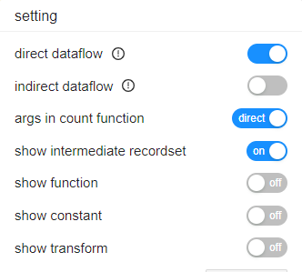

# DataFlowAnalyzer
Collects the end-to-end column-level data lineage in the Data Warehouses environment by connecting to database or 
analyzing SQL script especially stored procedure like PL/SQL.


This tool is built from the scratch, it is the main part of the backend of [the SQLFlow Cloud](https://sqlflow.gudusoft.com).

## Quick start

### 1. Analyze data lineage from SQL files	

Analyze demo.sql under sample directory and save the data lineage outpout in out.xml file.

```
java -jar gudusoft.dlineage.jar /t oracle /f ../sample/demo.sql /o out.xml
```

### 2. Analyze data lineage from a database
The dlineage tool can connect to the database instance and analyze the metadata to generate the data lineage automatically.

for example, connect to an Oracle database and analzye the data lineage, and save the data lineage in out.xml.

a metadata.json file that includes all metadata extracted from Oracle database will be saved to the current directory.

```
java -jar gudusoft.dlineage.jar /t oracle /fromdb "-dbVendor dbvoracle -host 127.0.0.1 -port 1521 -db orcl -user scott -pwd tiger" /o out.xml
```

### 3.2  Export the meatadata from database only

You can also export the meatadata from database only use this tool and then upload this metadata to [the Gudu SQLFlow Cloud](https://sqlflow.gudusoft.com)
to analyze the lineage.

- Only export the metadta
```
java -jar gudusoft.dlineage.jar /fromdb "-dbVendor dbvoracle -host 127.0.0.1 -port 1521 -db orcl -user scott -pwd tiger" /exportonly  /metadataoutput metadata.json
```


## Usage
```
"Usage: java DataFlowAnalyzer [/f <path_to_sql_file>] [/d <path_to_directory_includes_sql_files>] [/stat] [/s [/topselectlist] [/text] ] [/i] [/ic] [/lof] [/j] [/json] [/traceView] [/t <database type>] [/o <output file path>] [/version] [/env <path_to_metadata.json>] [/tableLineage [/csv]] [/transform [/coor]]");

/f: Optional, the full path to SQL file.
/d: Optional, the full path to the directory includes the SQL files.
/j: Optional, return the result including the join relation.
/s: Optional, simple output, ignore the intermediate results.
/topselectlist: Optional, simple output with top select results.
/i: Optional, the same as /s option, but will keep the resultset generated by the SQL function.
/if: Optional, keep all the intermediate resultset, but remove the resultset generated by the SQL function
/ic: Optional, ignore the coordinates in the output.
/lof: Option, link orphan column to the first table.
/traceView: Optional, only output the name of source tables and views, ignore all intermediate data.
/text: Optional, this option is valid only /s is used, output the column dependency in text mode.
/json: Optional, print the json format output.
/stat: Optional, output the analysis statistic information.
/tableLineage [/csv]: Optional, output table level lineage.
/csv: Optional, output column level lineage in csv format.
/t: Option, set the database type. Support access,bigquery,couchbase,dax,db2,greenplum,hana,hive,impala,informix,mdx,mssql,
sqlserver,mysql,netezza,odbc,openedge,oracle,postgresql,postgres,redshift,snowflake,
sybase,teradata,soql,vertica
, the default value is oracle
/o: Optional, write the output stream to the specified file.
/log: Optional, generate a dataflow.log file to log information.
/env: Optional, specify a metadata.json to get the database metadata information.
/transform: Optional, output the relation transform code.
/coor: Optional, output the relation transform coordinate, but not the code.
/defaultDatabase: Optional, specify the default schema.
/defaultSchema: Optional, specify the default schema.
/showImplicitSchema: Optional, show implicit schema.
/fromdb: Optional, specifies the database connection parameters.
/exportonly: Optional, just export metadata.json, no further data analysis.
/metadataoutput: Optional, specifies the metadata output directory and file name.
/filterRelationTypes: Optional, specify the relation types to be output, support fdd, fdr, join, call, er, multiple relation types separated by commas
/lv: Optional, output lineage for visualize
```


Here is the list of available database after /t option:
```
access,bigquery,couchbase,dax,db2,greenplum,hana,hive,impala,informix,mdx,mssql,
sqlserver,mysql,netezza,odbc,openedge,oracle,postgresql,postgres,redshift,snowflake,
sybase,teradata,soql,vertica
```

## 1. Binary version
https://github.com/sqlparser/gsp_demo_java/releases/ 
> update date: 2022/11/01

In order to run this utility, please install Oracle JDK1.8 or higher on your computer correctly.
	
## 2. Analyze data lineage from SQL files	
Please use `/f` parameter to specify a single SQL file,
or use `/d` parameter to specfify a directory that inculdes multiple SQL files.

```
java -jar gudusoft.dlineage.jar /t mssql /f path_to_sql_file
```

## 3. Analyze data lineage from a database
The dlineage tool can connect to the database instance and analyze the metadata to generate the data lineage automatically.


### 3.1 connect and analyze data lineage
Please use `/fromdb` parameter to export metadta from the database.

`/fromdb` parameter:

-dbVendor: Database type, Use colon to split dbVendor and version if specific version is required. (<dbVendor>:<version>, such as dbvmysql:5.7)

-host: Database host name (ip address or domain name)

-port: Port number

-db: Database name

-user: User name

-pwd: User password

-extractedDbsSchemas: Export metadata under the specific schema. Use comma to split if multiple schema required (such as <schema1>,<schema2>). We can use this flag to improve the export performance.

-excludedDbsSchemas:  Exclude metadata under the specific schema during the export. Use comma to split if multiple schema required (such as <schema1>,<schema2>). We can use this flag to improve the export performance.

-extractedViews: Export metadata under the specific view. Use comma to split if multiple views required (such as <view1>,<view2>). We can use this flag to improve the export performance.

`/exportonly` just export metadata.json, no further data analysis.

`/metadataoutput` specifies the metadata output directory and file name.

for example, connect to an Oracle database and analzye the data lineage.

- Oracle
```
java -jar gudusoft.dlineage.jar /t oracle /fromdb "-dbVendor dbvoracle -host 127.0.0.1 -port 1521 -db orcl -user scott -pwd tiger" /o oracle.xml
```

- SQL Server
```
java -jar gudusoft.dlineage.jar /t mssql /fromdb "-dbVendor dbvmssql -host 127.0.0.1 -port 1433 -db AdventureWorksDW2019 -user sa -pwd sa" /o sqlserver.xml
```

- MySQL
```
java -jar gudusoft.dlineage.jar /t mysql /fromdb "-dbVendor dbvmysql -host 127.0.0.1 -port 3306 -db employees -user mysqluser -pwd mysqlpwd" /o mysql.xml
```

- PostgreSQL
```
java -jar gudusoft.dlineage.jar /t postgresql /fromdb "-dbVendor dbvpostgresql -host 127.0.0.1 -port 5432 -db kingland -user pguser -pwd pgpwd" /o pg.xml
```


### 3.2  Export the meatadata only 

You can also export the meatadata from database and analzye the metadata in two steps:

- Only export the metadta
```
java -jar gudusoft.dlineage.jar /fromdb "-dbVendor dbvoracle -host 127.0.0.1 -port 1521 -db orcl -user scott -pwd tiger" /exportonly  /metadataoutput metadata.json
```

the metadata.json exported in this step can also be used with `/env` paramter to resolve the ambiguous columns problem in SQL query.

- analyze the metadta that generated in the previous step

```
java -jar gudusoft.dlineage.jar /t oracle /f metadata.json
```


## 4. Resolve the ambiguous columns in SQL query
```sql
select ename
from emp, dept
where emp.deptid = dept.id
```

column `ename` in the first line is not qualified by table name `emp`, so it’s ambiguous to know which table this column belongs to?

### solution 1, provides create table DDL 

Put the following DDL before the above SQL statement in the same SQL file.
the column `ename` will be linked to the table `emp` correctly.

```sql
create table emp(
	id int,
	ename char(50),
	deptid int
);

create table dept(
	id int,
	dname char(50)
);
```

### solution 2: provide metadata exported from database
Since dlineage v2.2.0 (2022/7/21), This dlineage tool supports `/env` parameter to accept a metadata json file
which includes the metadata exported from a database.

By providing metadata.json that includes the metadata, column `ename` should be linked to the table `emp` correctly.

You can use `/env` to specify a metadata.json like this:

```
java -jar gudusoft.dlineage.jar /t oracle /f path_to_sql_file /env metadata.json
```

You can always extract metadata from the database use the [sqlflow-ingester](https://github.com/sqlparser/sqlflow_public/releases) tool.

## 5. Relationship between this demo and the setting choices in SQLFlow


### direct dataflow (fdd), indirect dataflow (fdr)
In this demo, there is no corresponding parameter. 
You must filter out the relation types that you don't require because this dataflowAnalyzer demo will generate data lineage with all relation types, including fdd, fdr, join, and call.

### args in count function
related arg: `/treatArgumentsInCountFunctionAsDirectDataflow`

### show intermediate recordset, show function
The settings for "show intermediate recordset" and "show function" have no corresponding arguments in the demo
But by using those args, you can get the same outcome:

- don't specify any related args, this will output the same result as if you set `show intermediate recordset = true` and set `show function = true`
- /if, this will output the same result as if you set `show intermediate recordset = true` and set `show function = false`
- /i,  this will output the same result as if you set `show intermediate recordset = false` and set `show function = true` 
- /topselectlist, this will output the same result as if you set `show intermediate recordset = false` and set `show function = false` 

### show constant
/showConstant

### show transform
/transform /coor


## 6. Links
- [First version, 2017-8](https://github.com/sqlparser/wings/issues/494)

## 8、List of Supported dbVendors

| dbVendor      | databases     |
|---------------| ---------- |
| dbvoracle     | oracle     |
| dbvredshift   | redshift   |
| dbvpostgresql | postgresql |
| dbvmssql      | sqlserver  |
| dbvmysql      | mysql      |
| dbvazuresql   | azuresql   |
| dbvgreenplum  | greenplum  |
| dbvnetezza    | netezza    |
| dbvsnowflake  | snowflake  |
| dbvteradata   | teradata   |
| dbvhive       | hive       |
| dbvimpala     | impala     |
| dbvdb2        | db2     |
