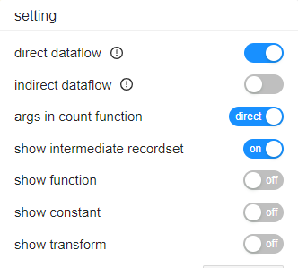

# DataFlowAnalyzer

Collects end-to-end, column-level data lineage from SQL scripts — including
stored procedures such as PL/SQL — by parsing them, with no database
connection. It is the demo form of the engine behind
[Gudu SQLFlow](https://sqlflow.gudusoft.com).

## Build and run

`DataFlowAnalyzer` is part of the ordinary root build. Nothing about it is
excluded, and there is no separate POM: from the repository root,

```bash
mvn package -DskipTests
```

produces `target/gsp_demo_java-1.0-SNAPSHOT-dlineage.jar`, an executable uber
jar with every runtime dependency inside it. Analyze the sample script:

```bash
java -jar target/gsp_demo_java-1.0-SNAPSHOT-dlineage.jar \
     /f samples/dlineage/demo.sql /o lineage.json /json
```

On parser 4.2.6 that writes 24 relationships. Drop `/json` for the XML form.
Run it with no arguments to print the full option list for the parser version
you have; the list under "Options" below is reproduced from that output.

> **Use the jar, not `mvn exec:java`, for this demo.** Most demos in this
> repository run happily through `exec:java`, but this one marshals its output
> with JAXB, and `exec:java` loads it in a child classloader while
> `javax.xml.datatype` comes from the boot classloader. On JDK 21 that fails
> before any lineage is printed:
>
> ```
> loader constraint violation: when resolving field "DATETIME" of type
> javax.xml.namespace.QName ... have different Class objects
> ```
>
> The uber jar has no such split, which is the reason it exists and the reason
> CI exercises it through `.github/scripts/smoke-dlineage-jar.sh`. Any other
> demo class runs from the same jar too:
> `java -cp target/gsp_demo_java-1.0-SNAPSHOT-dlineage.jar <main.Class> …`

> **The jars on [the Releases page](https://github.com/sqlparser/gsp_demo_java/releases)
> are not this build.** The newest, `gudusoft.dlineage-3.0.2.3`, was published
> 2024-11-02 — before the 2026-07 package reorganisation and several parser
> releases. Build from source with the command above rather than downloading
> one.

### Output formats

Column-level XML (the default), column-level JSON (`/json`), and table-level
CSV:

```bash
java -jar target/gsp_demo_java-1.0-SNAPSHOT-dlineage.jar \
     /f samples/dlineage/demo.sql /tableLineage /csv
```

```
source_db,source_schema,source_table,source_column,target_db,...,target_column,process_type,...
default,default,dept,deptno;dname,default,default,deptsal,dept_no;dept_name,sstinsert,...
default,default,emp,sal;comm,default,default,deptsal,salary,sstinsert,...
```

`/s` drops the intermediate result sets and reports only tables and columns,
which is usually what you want when the lineage is going into another tool.

## The trial parser's 10,000-byte limit

This repository resolves the **trial** parser, which refuses any single script
over 10,000 bytes:

```
trial version can only process query with size of at most 10000 bytes,
and expired after 90 days after first usage.
```

You do not get a crash — you get a `<dlineage>` document whose only content is
an `<error>` element, which is easy to mistake for "no lineage found".

`samples/dlineage/demo.sql` is 366 bytes and works. **16 of the 89 `.sql` files
under `samples/` are over the limit, and every one of them is a vendor schema
dump under `samples/dlineageBasic/`** — `hr_cre.sql`, `sakila-schema.sql`,
`instawdbdw.sql` and the rest, from 10,378 up to 99,139 bytes. Those need a
licensed parser.

For schema-scale lineage on the trial jar, use
[`samples/dlineageBasic/oracle/hr_mini/`](../../../../../../../samples/dlineageBasic/oracle/hr_mini/readme.md),
added for exactly this reason — 5,212 bytes, and 120 relationships:

```bash
java -jar target/gsp_demo_java-1.0-SNAPSHOT-dlineage.jar \
     /f samples/dlineageBasic/oracle/hr_mini/hr_mini.sql /t oracle /json
```

It carries staging tables, a view over a `LEFT JOIN`, a CTE, aggregates, `CASE
WHEN` and a correlated subquery, with all its DDL in the file so every column
resolves. CI runs it and fails if it ever crosses the 10,000-byte line.

## There is no `/fromdb`

It was removed on 2026-08-24, along with `/exportonly` and `/metadataoutput`.
The flags parsed and then did nothing: the call they existed for,
`SqlflowIngester.export(...)`, had been commented out and that class deleted, so
the tool emitted an empty `<dlineage/>` and wrote no `metadata.json` while this
readme taught the feature in two sections with four vendor examples. Passing
`/fromdb` now gets the same answer as passing nothing:

```
Please specify a sql file path or directory path to analyze dlineage.
```

Live JDBC catalog extraction needs `gudusoft.gsqlparser.sqlenv.T*SQLDataSource`,
which the public trial parser does not ship — see
[`licensed-only/`](../../../../../../../licensed-only/README.md). To give this
demo real metadata, export it elsewhere and pass the JSON with `/env`; see
"Resolving ambiguous columns" below.

## Options

Reproduced verbatim from the tool's own output on parser **4.2.6** — run it
with no arguments to get the authoritative list for the version you have,
rather than trusting this copy.

```
Usage: java DataFlowAnalyzer [/f <path_to_sql_file>] [/d <path_to_directory_includes_sql_files>] [/stat] [/removeResultSetTypes <resultset_types>] [/removeVariable /removeCursor] [/removeUnusedSynonym] [/n] [/s [/topselectlist] [/text] [/withTemporaryTable] [/simpleShowRelationTypes <relationTypes>]] [/i] [/showResultSetTypes <resultset_types>] [/showVariable] [/showCursor] [/showSynonym] [/ic] [/lof] [/j] [/json /graph] [/traceView] [/t <database type>] [/o <output file path>] [/version] [/env <path_to_metadata.json>]  [/tableLineage [/csv [/delimeter <delimeter>]]] [/csv-simple] [/transform [/coor]] [/showConstant] [/showER] [/treatArgumentsInCountFunctionAsDirectDataflow] [/showCaseWhenAsIndirect] [/filterRelationTypes <relationTypes>] [/lv] [/traceTablePosition]
/f: Optional, the full path to SQL file.
/d: Optional, the full path to the directory includes the SQL files.
/j: Optional, return the result including the join relation.
/n: Optional, normalize output.
/s: Optional, simple output, ignore the intermediate results.
/topselectlist: Optional, simple output with top select results.
/simpleShowRelationTypes: Optional, simple output with specified relation types, support fdd, fdr.
/withTemporaryTable: Optional, determine whether to output the temporary tables in simple output, default is false.
/i: Optional, the same as /s option, but will keep the result set generated by the SQL function, this parameter will have the same effect as /s /topselectlist + keep result set generated by the sql function.
/showResultSetTypes: Optional. This option is valid only when /s or /i option is used, and is used to specify the result set types to be output, separate with commas, result set types contains array,  struct, result_of, cte, insert_select, update_select, merge_update, merge_insert, output, update_set,
	pivot_table, unpivot_table, alias, rs, function, case_when
/showVariable: Optional. This option is valid only when /s or /i option is used, and is used to reserve all the variables and cursors.
/showCursor: Optional. This option is valid only when /s or /i option is used, and is used to reserve all the cursors.
/showSynonym: Optional. This option is valid only when /s or /i option is used, and is used to reserve all the synonyms.
/removeResultSetTypes: Optional. This option is used to remove the specified result set types to be output, separate with commas, result set types contains array,  struct, result_of, cte, insert_select, update_select, merge_update, merge_insert, output, update_set,
	pivot_table, unpivot_table, alias, rs, function, case_when
/removeVariable: Optional. This option is remove all the variables and cursors.
/removeCursor: Optional. This option is remove all the cursors.
/removeUnusedSynonym: Optional. This option is remove all the unused synonym.
/if: Optional, keep all the intermediate result set, but remove the result set generated by the SQL function
/ic: Optional, ignore the coordinates in the output.
/lof: Option, link orphan column to the first table.
/traceView: Optional, only output the name of source tables and views, ignore all intermediate data.
/text: Optional, this option is valid only /s is used, output the column dependency in text mode.
/json: Optional, print the json format output.
/graph: Optional, print the json format output with graph information.
/stat: Optional, output the analysis statistic information.
/tableLineage [/csv /delimiter]: Optional, output table level lineage.
/csv: Optional, output column level lineage in csv format.
/csv-simple: Optional, output column level lineage in a simplified csv format (source schema.table.column, target schema.table.column, relation type), excluding records that reference the synthetic RelationRows column.
/delimiter: Optional, the delimiter of output column level lineage in csv format.
/t: Option, set the database type. Support access,bigquery,couchbase,dax,db2,gaussdb,greenplum,hana,hive,impala,informix,mdx,mssql,
sqlserver,mysql,netezza,odbc,openedge,oracle,postgresql,postgres,redshift,snowflake,
sybase,teradata,soql,vertica
, the default value is oracle
/o: Optional, write the output stream to the specified file.
/log: Optional, generate a dataflow.log file to log information.
/env: Optional, specify a metadata.json to get the database metadata information.
/transform: Optional, output the relation transform code.
/coor: Optional, output the relation transform coordinate, but not the code.
/defaultDatabase: Optional, specify the default schema.
/defaultSchema: Optional, specify the default schema.
/showImplicitSchema: Optional, show implicit schema.
/showConstant: Optional, show constant table.
/treatArgumentsInCountFunctionAsDirectDataflow: Optional, treat arguments in count function as direct dataflow. Default is false.
/showER: Optional, show entity relationship.
/showCaseWhenAsIndirect: Optional, treat CASE WHEN conditions as indirect dataflow. Default is false.
/filterRelationTypes: Optional, specify the relation types to be output, support fdd, fdr, join, call, er, multiple relation types separated by commas
/lv: Optional, output lineage for visualize
/traceTablePosition: Optional, trace all table positions. Default is false.
```

## Resolving ambiguous columns

```sql
select ename
from emp, dept
where emp.deptid = dept.id
```

`ename` is not qualified, so on its own the analyzer cannot know which table it
belongs to. There are two ways to tell it.

### Solution 1 — put the DDL in the same script

Prepend the `CREATE TABLE` statements and `ename` links to `emp` correctly:

```sql
create table emp(
	id int,
	ename char(50),
	deptid int
);

create table dept(
	id int,
	dname char(50)
);
```

Watch the 10,000-byte trial limit: DDL plus query counts as one script.

### Solution 2 — supply metadata with `/env`

```bash
java -jar target/gsp_demo_java-1.0-SNAPSHOT-dlineage.jar \
     /t oracle /f path_to_sql_file /env metadata.json
```

The same metadata JSON also drives the `columninspect` demo, which has a
runnable pair checked in at `samples/columninspect/`. Nothing in this
repository can produce the file — export it with a licensed build or the
[sqlflow-ingester](https://github.com/sqlparser/sqlflow_public/releases) tool.

## How the options map to SQLFlow's settings



### Direct dataflow (fdd), indirect dataflow (fdr)

No corresponding option: this demo emits every relation type — fdd, fdr, join
and call. Use `/filterRelationTypes` to narrow the output.

### Arguments in the count function

`/treatArgumentsInCountFunctionAsDirectDataflow`

### Show intermediate recordset, show function

No single option, but the combinations cover it:

| options | equivalent settings |
|---|---|
| *(none)* | show intermediate recordset = true, show function = true |
| `/if` | show intermediate recordset = true, show function = false |
| `/i` | show intermediate recordset = false, show function = true |
| `/topselectlist` | show intermediate recordset = false, show function = false |

### Show constant

`/showConstant`

### Show transform

`/transform /coor`

## Supported `dbVendor` values

Used in the `dbVendor` field of a metadata JSON, and by SQLFlow itself:

| dbVendor      | database   |
|---------------|------------|
| dbvoracle     | oracle     |
| dbvredshift   | redshift   |
| dbvpostgresql | postgresql |
| dbvmssql      | sqlserver  |
| dbvmysql      | mysql      |
| dbvazuresql   | azuresql   |
| dbvgreenplum  | greenplum  |
| dbvnetezza    | netezza    |
| dbvsnowflake  | snowflake  |
| dbvteradata   | teradata   |
| dbvhive       | hive       |
| dbvimpala     | impala     |
| dbvdb2        | db2        |

## Links

- [First version, 2017-8](https://github.com/sqlparser/wings/issues/494)
